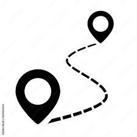
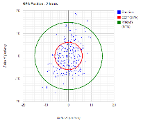

# Methodologies

Increasing the probability of matching a Capture

### Status.

Currently, too many matching possibilities appear within the range and Planters take a while until they match the first capture.

### Objective.

Improve the Matching Probability by organising the potential matches.

### Possibilities.

###  1) Using old paths.

Suggest the _first potential_ as the same last installed before the current match.

Example if X is initial planting path and Y the first recapture plan.

If the path goes X1, X2, X3, after matching X1 with the new Y1, the first suggestion for Y2 should be X2 and after X3.

###  2) Closeness.

Suggest the _first Potential_ as the one closer to the capture. Organize the list by measuring the distance between the capture and the potentials.

###  3) GPS Accuracy and distance.

With the value of Accuracy in both Capture and Recapture, modify the value of “6” into something dependable of it, reducing it with the accuracy is better than 3 or 4, to reduce the amount of potential captures.

###  4) Image recognition through AI

Use AI to better match the images, by organizing the list on a probability base. It requires more computational effort.

### Procedure

Test the three scenarios and calculate the matching accuracy for each case with real data.

`SELECT count(*) FROM trees WHERE ST_Intersects (estimated_geometric_location, ST_MakeEnvelope ( -13.182-- xmin (min lng), 8.442 -- ymin (min lat), -13.183 -- xmax (max lng), 8.441 -- ymax (max lat), 4326 -- projection epsg-code)::geography('POLYGON')) and length(trees.note) > 5;`

This result shows the first capture. `trees.note = '1'`  will show the first retracking and `trees.note like '2'` will show the second re tracking&#x20;
