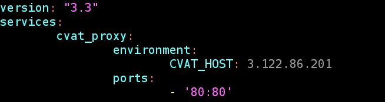

# CVAT Administration

### **Deploying from EC2 terminal**&#x20;

Log into AWS EC2 with AWS credentials, and select the CVAT server instance. Note that you should have superadmin access in CVAT to begin with if you are performing this step. First, [follow the steps at the CVAT Github](https://openvinotoolkit.github.io/cvat/docs/administration/basics/installation/) repo to get started.&#x20;

After the initial build, you can restart the CVAT app with the following commands:

`cd cvat`

`docker-compose -f docker-compose.yml -f components/analytics/docker-compose.analytics.yml -f docker-compose.override.yml build`

`docker-compose -f docker-compose.yml -f components/analytics/docker-compose.analytics.yml -f docker-compose.override.yml up -d`

Note that this rebuilding step will not erase/modify existing annotations, users, tasks, etc.- these are persisted in the associated Docker volumes. To erase the app completely, you will need to delete all associated volumes as well.&#x20;

Changes in the `docker-compose.override.yaml` file should follow a format similar to:

**Known Issues and Bugs:**

*   “Bind address in use” during `docker-build`

    Solution: a service is blocking the port you are trying to use. `sudo /etc/init.d/apache2` stop usually works.

### **Using the CVAT command line:**

This is applicable for anyone who has been added as a user in a deployed CVAT instance.

Clone the`cvat` repo and use `./cli.py in cvat/utils/cli/`

**Known Issues and Bugs:**

* Despite being marked as optional, “label” option is not optional and must be supplied when creating a new task:

### Filtering within the UI

Ex. you can use assignee:x AND status:validation to see what tasks from an individual need to be validated still.&#x20;
