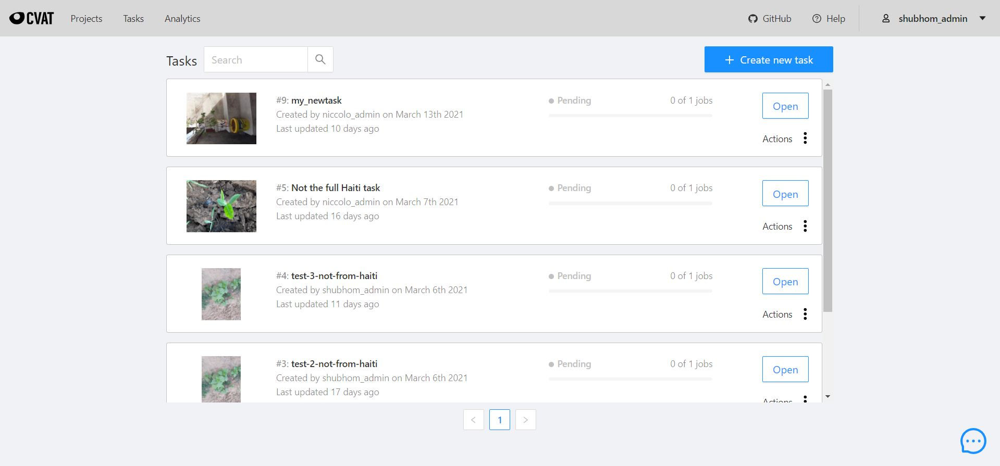
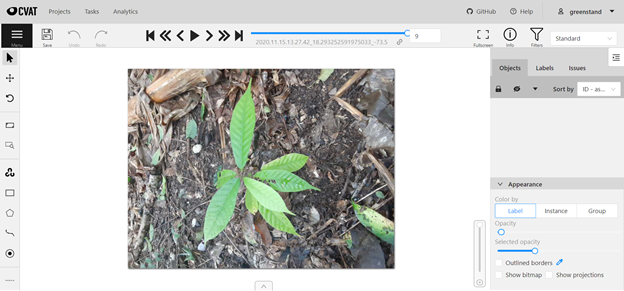
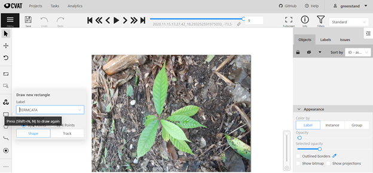
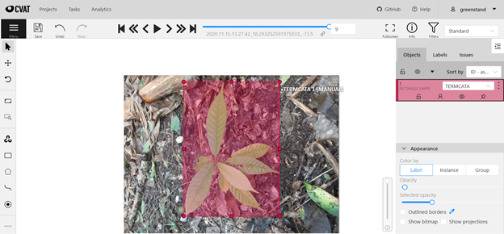
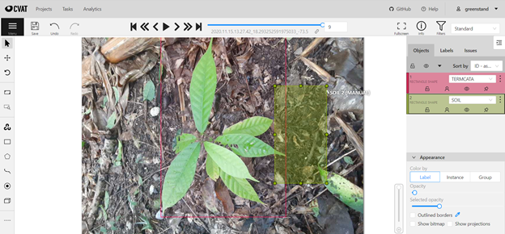
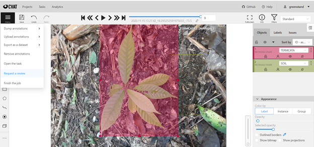

# How to Annotate for Greenstand

This document is a compilation of useful resources for the Computer Vision Annotation Tool (CVAT) used by Greenstand to annotate images, currently hosted at [annotate.treetracker.org](http://annotate.treetracker.org). The purpose of this exercise is to define ground truth for algorithms to be based off of in the future.

The best place to learn about using the CVAT application is the [**CVAT User Guide**](https://openvinotoolkit.github.io/cvat/docs/manual/basics/). The sections relevant to you are: Interface, Basic Navigation, Top Panel, Controls Sidebar.&#x20;

### **Step 0: Before you get started**

Before you get started, you should have been sent a set of credentials by an administrator as well as access to the #ml\_annotations Slack channel. Please reach out to Shubhom (shubhom.bhattacharya@greenstand.org) or Elm Outcault (elm.outcault@greenstand.org) if you are missing one or both of these.

### **Step 1: Accessing CVAT Jobs**

After an administrator provides you credentials and the [app URL](http://annotate.treetracker.org), you should be able to view jobs assigned to you automatically. After clicking on your job, the UI will open and display images to you.&#x20;

### **Step 2: Referencing the Greenstand Herbarium**

You’ll want to reference the [Greenstand digital herbarium](https://herbarium.treetracker.org/guide/index.html), a place where you can view selected samples belonging to each taxa. As of writing, look for the 8-character Greenstand Code. Read [this](https://herbarium.treetracker.org/guide/names.html) to find out more about naming species.

Some tips for distinguishing species:

* Read [this document](https://herbarium.treetracker.org/guide/sdl\_id.html) first.
* Of course, look for distinctive features, like spots, flowers, and coloration .
* Pay attention to any comments in the herbarium. These will tell you similar-looking species that might be confusing or other interesting features.
* Most species are best distinguished by their leaves.

### **Step 3: Completing annotations on CVAT:**

In all cases, an admin will have defined some labels for you to select from. To learn how to select labels and regions of interest, refer to the [CVAT User Guide](https://openvinotoolkit.github.io/cvat/docs/manual/basics/).

Usual tasks to accomplish while annotating:

* Bounding box around the tree + specify label for that species
  * You’ll select the label for the species, draw a rectangle around the tree, and modify any attributes required.
* Tree vs. non-tree label for the full image
  * Images that don’t contain trees or trees that are completely indiscernible as individual trees should be marked in this category

**Imporant**: **Remember to save your work frequently!** If you can't complete the task in one session, you can hit save and return where you left off and after completing the full job assigned to you, you can hit “Menu” and “Submit for review”. If working on a larger job, it’s best to save from time to time to make sure you don’t lose your work. Someone will usually review your work and contact you with further steps.

**What is this used for?**

The goal of the annotation process is to provide manual checks for images of seedlings, which we call "captures". With high-quality capture metadata, difficult tasks like species identification and tree quality analysis can be automated, especially as Greenstand grows. These annotations provide a way to crowdsource the way in which metadata is collected.&#x20;

**Full Example**

Now we’ll cover a full example. In this task, the goal is to label a few things:

* the presence of one of the species (or any tree at all)
* the presence of any freshly dug earth, which indicates a newly planted seedling

First, the initial menu after logging in will look like this. Tasks that you have been assigned are visible in this menu, and you can work on any of them.

Click the “Open” button for that task will lead you to its page.&#x20;

.jpeg>)

Click on the highlighted-blue Job # for the job you want to begin or resume. The top right "Assigned to:" should list you as the assigned annotator.

Now, you will be able to click the rectangle on the left-side menu and create bounding boxes as specified in the User Guide. In this case, we draw a rectangle for the plant of interest. After referencing the herbarium, it seems that the plant belongs to the species _Terminalia catappa_ (code TERMCATA), so we choose that label. Make sure your rectangle completely encompasses the plant; i.e. expand it to the outermost points of the plant. In other words, create the smallest rectangle possible that includes every part of the plant (leaves, stem, etc.) as best you can. This is useful because machine learning models will want to leave out most information unrelated to the plant being focused on, but won't want to miss potentially useful information about that plant.

.png>)

You can draw the rectangle by clicking where the top-left and bottom-right corner would be. Try to include each point in the plant that you can identify within one rectangle, unless instructed otherwise.&#x20;

You can also include a box for the presence of freshly dug earth (label SOIL).

You can delete a label and redo it by clicking on the 3 dots on the label on the right-hand menu and selecting "Remove". The boxes are also draggable and resizeable within the image.&#x20;

When you are finished with the task, you can submit it for review. Please also use the workflow in #ml\_annotations with the the task # and name so that reviewers know to look out for your task.

You can click on request a review when you're done.

.png>)

and you can use the + sign at the bottom left to access the "Request task review" workflow, where you will enter the task ID number and name.&#x20;

Your reviewer will then review the submission and flag any issues. If no issues are found, the reviewer will accept the submission and you'll be finished with the task! You can request your next task using the "Request a task" workflow in the #ml\_annotations channel.&#x20;

If you have any questions, please ask in the #ml\_annotations channel in Slack, or contact Shubhom at shubhom.bhattacharya@greenstand.org or shubhomb on Slack.&#x20;

**Reference Videos**

CVAT provides a list of useful videos for further details.

* [https://www.youtube.com/watch?v=OMgQ2JzOAWA](https://www.youtube.com/watch?v=OMgQ2JzOAWA)
