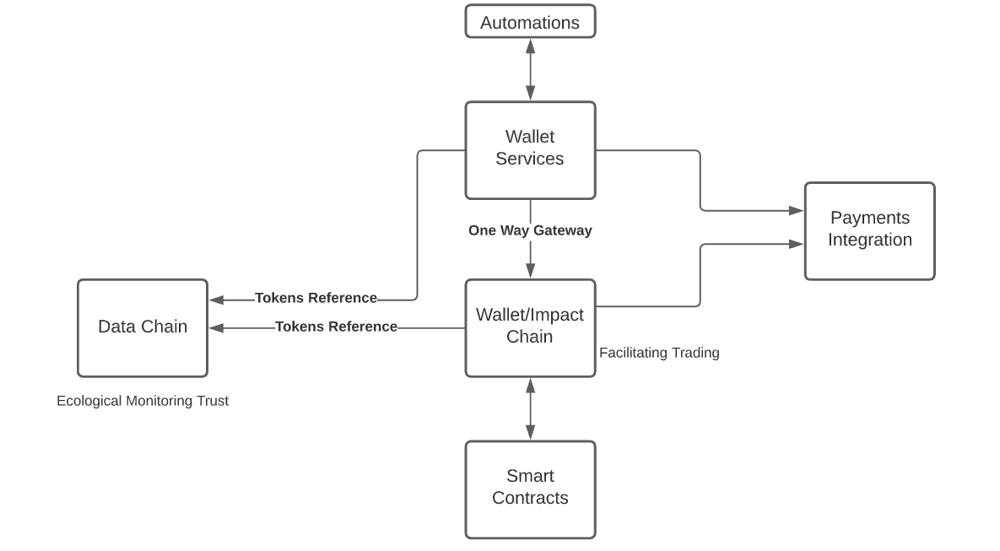

# Blockchain at Greenstand

## Introduction

Blockchain is a new technology that can solve problems in trust and distributed computing using cryptographically verifiable event histories.  We are now researching specific use cases for blockchain in the Treetracker platform, and interrogating which specific problems blockchains might solve for our target users.

## Use Cases

### Data Chain

_Track changes to data in a robust and open ledger._  &#x20;

When data is accessed, users want to know that the data has not been changed since ingest, or if it has they want to see the audit trail of those changes.  Changes include actions like approval, tagging, or applying fixes to data that was incorrectly reported from the field.

### Wallet Chain

_Track changes to impact tenure_

As impacts move between wallets, users want to know that the chain of custody of these impacts has been robustly tracked and not fraudulently altered behind the scenes.  Users may also want to know further details about parameters of transaction history, or how token type and value factor assignment have changed over time with respect to an underlying capture.  Note that tracking these changes on a blockchain does not require that users actually operate transactions against a blockchain - a microservice can simply write changes out to a blockchain for audit.

_Facilitate trades_

Allow tokens existing in our centralized wallet microservice to move through a gateway into a fully distributed blockchain trading context.  Allow blockchain users to request and clear transfers of these digital assets.

### Smart Contracts

_Allow creation and distributed execution of user defined smart contracts._ &#x20;

Users often want automated transactions to occur in our wallet system when certain criteria are met.  This need can be met with automations in our cloud, but requires direct oversight and operation of these codes.  Smart contracts would allow creation of automated transactions independently of Greenstand engineering, though introduces additional technical load on integrating or

### Distributed Computing

_Pay Greenstand Engineers to provide cloud compute/memory/bandwidth for certain parts of our platform_

We pay Digital Ocean and AWS for cloud resources currently.  Perhaps we could pay volunteers who want to provide these resources instead, if some aspects of our cloud could be hosted on a distributed blockchain based system, such as akash.network.  In particular, this could give African technologists access to one of our already existing payment streams.

## Conceptual Diagram

