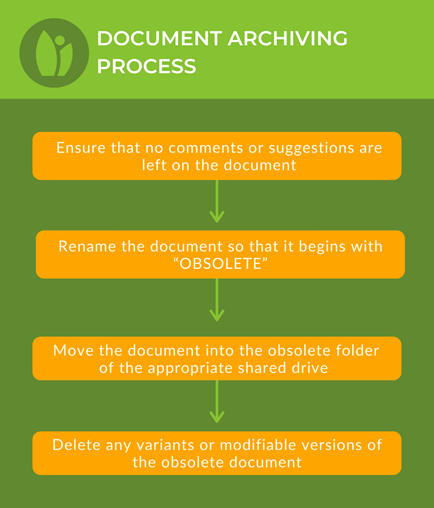

# Document Creation & Archiving

### **Content Review Process**

Each division at Greenstand follows a review process for documents and other content. It starts with drafting and posting the content for review in relevant Slack channels. After applying edits and feedback, the document should repost and get at least 2 approvals other than the channel lead. Final approval is indicated by reacting to the Slack post with a “thumbs up” emoji.

&#x20;        &#x20;

.png>)

### &#xD;**Requirements for Approval**

* Post draft content to the relevant Slack channel
* Layout and images need approval too.
* Receive 2 “thumbs up” reactions.
* Receive approval from two sources:&#x20;
  * Channel lead &
  * VP Operations, Tabitha Kelly, or Executive Director, Ezra Jay

### Content Requiring Approval

*

  Mass emails (5+ recipients)
* Social media posts
* Blog posts
* Website edits
* Newsletters
* External interviews & general communications

### Document Archiving Process&#x20;

