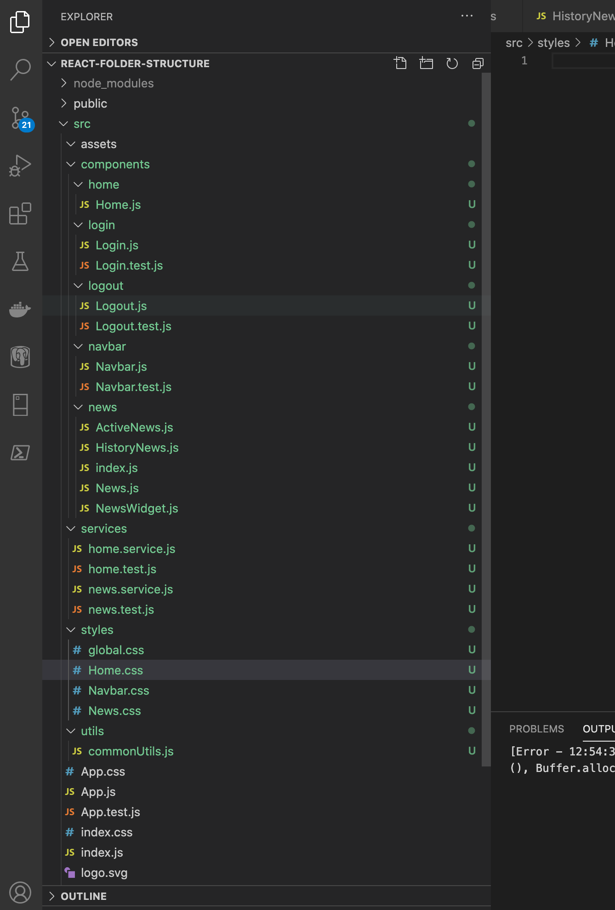

# React Coding Practices


* **Folderize Your Components** (related files in one folder)



*   **Componentize Your Code**&#x20;

    * Each file should fix to small functionality (each with a single responsibility)
    * Create many utility files that can help remove duplicate code from multiple files


*   **Naming Conventions**

    * Name your file logically according to the job that they perform
    * React UI component's name should be PascalCase (UpperCamelCase)

    ```
    Example: WalletSlider.js
    ```

    * All other helper files should be camelCase

    ```
    Example: commonUtils.js
    ```

    * CSS files should be named the same as component PascalCase. Global CSS (applies to all components) should be placed in global.css and should be named in camelCase

    ```
    Example: WalletSlider.css (for component), global.css (for global styles)   
    ```

    * Test files should be named after the component or non-component file

    ```
    Example: WalletSlider.test.js
    ```


* **Other**
  *   Destructuring your props is a good way to help make your coder cleaner and more maintainable.

      ```
      Example: (async function authenticate({user_id, token}){})
      ```
  * Use **useReducer** when **useState** becomes complex.


Always review your code before creating a pull request.



