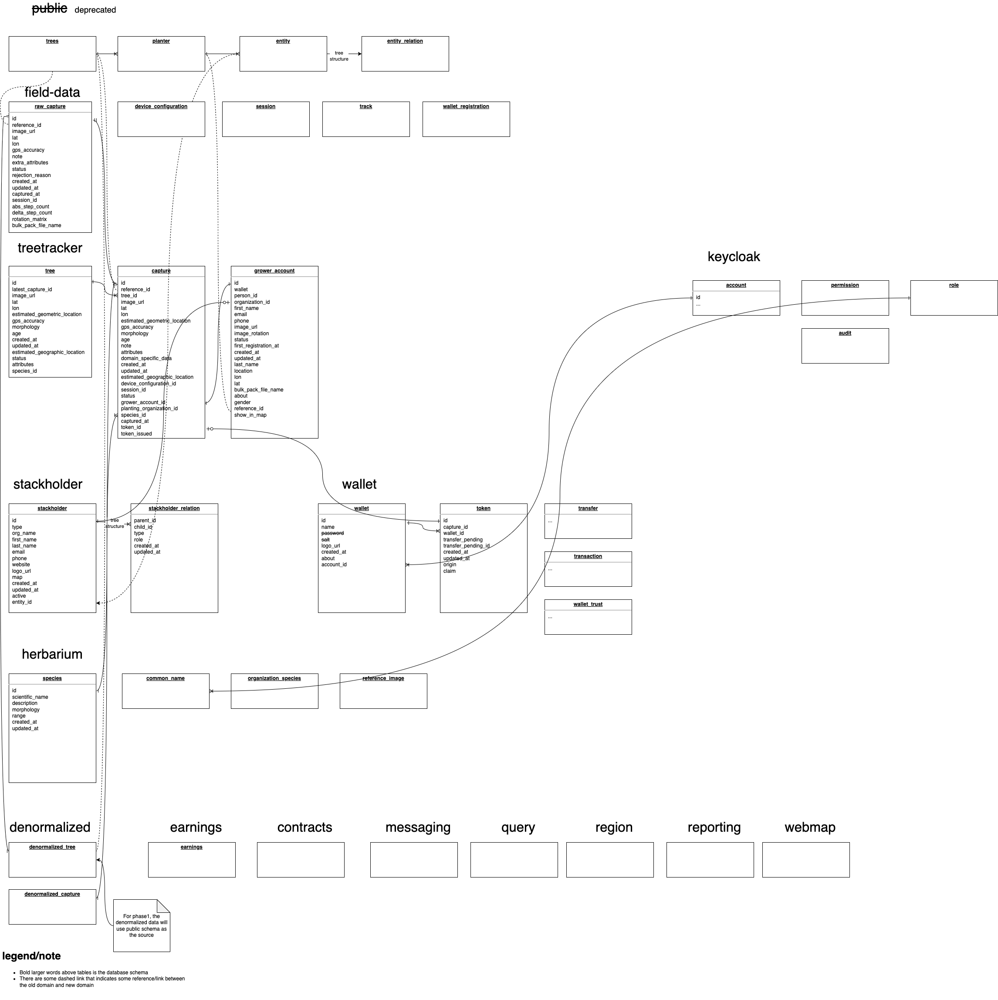

# V2 web map

The v2 web map is a project to let the current web map to adapt our new database domain, in the new domain, we evolved a better business modal for a long-term vision and growth for Greenstand.

**keywords and tech stack involved:** Node.js, Typescript, RESTful API, Knex, SQL, tile-server

GitHub project:



Design

The ERD

<figure><figcaption></figcaption></figure>



API:



Development tips:

* Please checkout branch `v2` to work on, this is the branch we are using to implement the feature: [https://github.com/Greenstand/treetracker-web-map-client/tree/v2](https://github.com/Greenstand/treetracker-web-map-client/tree/v2)
* The work on the branch `v2` will be deployed automatically on every merge to [https://alpha-dev.treetracker.org/](https://alpha-dev.treetracker.org/)
*
